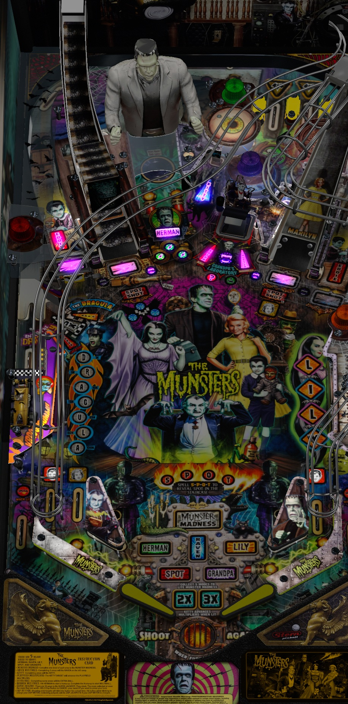

# Munsters (Original 2020)

---

## Files
| File Type | Link | Version | Author | 
|-----------|--------|----------|--------------|
| **VPX** | [VP Universe](https://vpuniverse.com/files/file/10068-munsters-original-2020-105vpx/) | 1.0 | [allknowing2012](https://vpuniverse.com/profile/5615-allknowing2012/) |
| **B2S** | N/A | N/A | N/A |
| **DMD** | N/A | N/A | N/A |
| **ROM** | N/A | N/A | N/A |

**Tested by:** [Silentkat]

---

## Status 
**Minimum VPX Standalone build:** 10.8.0-5b941e6
| Playfield | Backglass | DMD | ROM Required | FPS | Has Puppack |
|-----------|----------|-----------|-----|--------------|-----|
| :white_check_mark: | :white_check_mark: | :x: | :x: | 45 | white_check_mark |

---

 
<table>
  <tr>
    <td style="background-color: #FFDDDD; padding: 0; border-left: 4px solid #FF0000;">
      

        <strong>⚠️ WARNING ⚠️</strong>
      

      

        Manually added puppacks are not supported by the VPXS 4KP team We will not be able to help you diagnose issues until this puppack is in the Wizard
      

    </td>
  </tr>
</table>
 

---

## Instructions
- Copy the contents of this repo folder to your USB drive
- Add your personalized launcher.elf and rename it to `vpx-munsters.elf`
- Download the table from above link and copy it into `vpx-munsters`
- Make sure `(.vpx)` `(.vbs)` and `(.ini)` are all named the same.
- Create the folder `pupvideos` within the `external/vpx-munsters`
- Download `PUPVideos_mmunsters_1.05.zip` from the same link above
- Extract the folder `mmunsters` from the archive, and put it in the `pupvideos` folder.
- Unzip the `use_these_pup_files.zip` and place them inside the `pupvideos/mmunsters` folder, and overwrite files if prompted.

